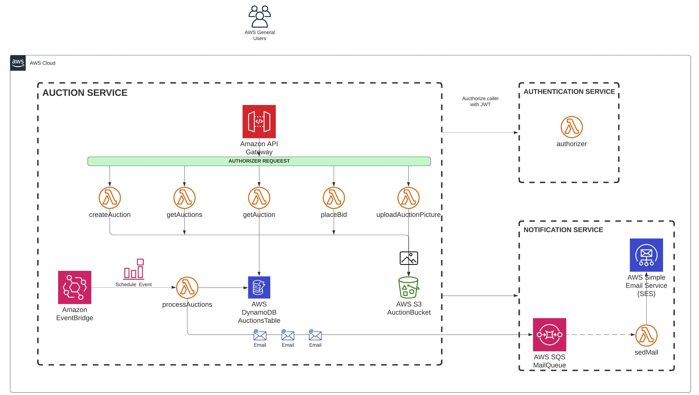

# AUCTION SERVICE REST API

Simple REST API using the Serverless Framework

## Install

    npm install
    npm install -g serverless

## Must used commands during development process

### AWS Credential configuration

    https://www.serverless.com/framework/docs/providers/aws/guide/credentials/
    https://docs.aws.amazon.com/serverless-application-model/latest/developerguide/serverless-getting-started-set-up-credentials.html

### Deploy the app

    sls deploy --verbose
    sls deploy --verbose --aws-profile development
    sls remove --verbose --aws-profile development
    sls deploy --verbose --stage dev --aws-profile development

### Execute functions

    sls deploy function -f createAuction --verbose --aws-profile development
    sls deploy function -f getAuction --verbose --aws-profile development
    sls deploy function -f getAuctions --verbose --aws-profile development

### Middy

    repo: https://github.com/middyjs/middy
    npm install @middy/core @middy/http-event-normalizer @middy/http-error-handler @middy/http-json-body-parser

### Commands to see the logs

    sls logs -f processAuctions --aws-profile development
    sls logs -f processAuctions --startTime 1m --aws-profile development
    sls logs -f processAuctions -t --aws-profile development

### Serverless dashboard

    serverless

### Manual execution of a function

    sls invoke -f processAuctions -l --aws-profile development
    sls deploy function -f processAuctions --verbose --aws-profile development
    sls deploy function -f uploadAuctionPicture --verbose --aws-profile development
    sls logs -f uploadAuctionPicture -t
    sls info --aws-profile development

## API Endpoints (backend routes)

​
| HTTP Method | URL | Request Body | Success status | Error Status | Description |
| ----------- | --------------------------- | -------------------------------------------------- | -------------- | ------------ | ------------------------------------------------------------ |
| POST | `{{AUCTION_HOST}}/auction` | {"title": "Fambruesas"} | 200 | 500 | Create new Auction |
| GET | `{{AUCTION_HOST}}/auctions?status=OPEN` | | 200 | 500 | Find all OPEN or CLOSED Auctions |
| GET | `{{AUCTION_HOST}}/auction/:id` | | 200 | 404, 500 | Find Auction by ID |
| PATCH | `{{AUCTION_HOST}}/auction/:id/bid` | | 200 | 400, 500 | Bid Auction |
| PUT | `{{AUCTION_HOST}}/auction/:id/picture` | | 200 | 400, 500 | Upload picture for auction ID |
​
​

# REST API Description

The REST API to the example app is described below.

## Get list of Things

### Request

`GET /thing/`

    curl -i -H 'Accept: application/json' http://localhost:7000/thing/

### Response

    HTTP/1.1 200 OK
    Date: Thu, 24 Feb 2011 12:36:30 GMT
    Status: 200 OK
    Connection: close
    Content-Type: application/json
    Content-Length: 2

    []

​

## Architecture Diagram

​

## Microservices related with this Project

​
​

## Links

​

### Notion

​

​

### Documentation

​
